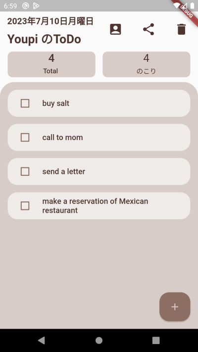

# Name（リポジトリ/プロジェクト/OSS などの名前）

MY Todo アプリ

# DEMO

# Features

・他のデバイスでも確認できるよう共有機能付き  
・日付表示  
・合計と残りの ToDo 数を表記  
・飽きないかつ柔らかい雰囲気のシンプルな UI デザイン  
・ボタンのどこを触れてもチェックのつけ外しが可能  
・名前の変更が可能

# Requirement

provider: ^6.0.5  
share_plus: ^7.0.2  
intl: ^0.18.1

# Note

## 実現したかったこと

・MVVM 設計  
・provider の活用  
・日本語での時間表記  
・共有機能の実装  
・角を丸くした UI デザイン

# Author

作成者　 Tomomi Shinada
E-mail sinaxyxx@yahoo.co.jp

# License

This application is under [MIT license]
